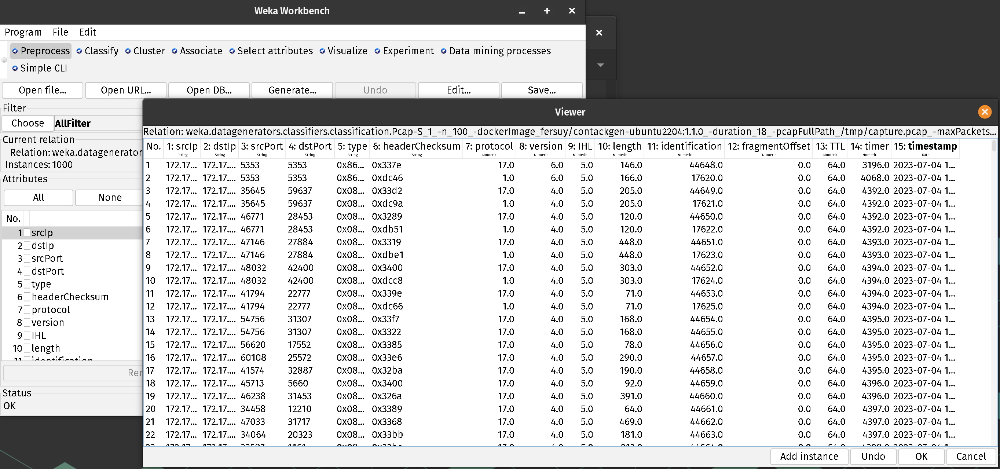

# ConTackGen-Plugin
ContackGen is a contexctual cyber-attack data generator for Weka.

## Table of Contents
- [ConTackGen-Plugin](#contackgen-plugin)
  - [Table of Contents](#table-of-contents)
  - [Build](#build)
  - [Install](#install)
  - [Usage](#usage)
  - [Limitation](#limitation)
  - [Authors](#authors)

## Build
Weka plugin are compiled with ant. To build the plugin, you need to install ant.

```bash
sudo apt-get install ant
```

Ant works with a build.xml file. This file contains the instructions to build the plugin (like a Makefile).

Then, you can build the plugin with the `make_package` command:

```bash
ant make_package -Dpackage ConTackGen
```

The plugin is now in the `dist` folder.

```bash
$ ls dist/
ConTackGen ConTackGen.zip
```

The `ConTackGen.zip` can be directly installed in any Weka version. 


## Install
First running Weka and select the tab `Tools` and `Package Manager`. Then under `Unoffcial` select `file/ur` and select the `ConTackGen.zip` file. Finally, click on `install` and restart Weka.

## Usage
On Weka main page, select `Workbench`, `Generate` then `choose` to select `pcap` under **classification** directory. Then `Generate` to start the data generator.



> Select "edit" to view data details.

## Limitation
The issue you are encountering with your Java Weka plugin, specifically the ConTackGen plugin, seems to be related to its compatibility with different versions of Weka. Let's break it down step by step:

- The plugin, ConTackGen, functions correctly when running Weka from the source code on VsCode. This indicates that the plugin itself is likely implemented correctly.
- However, when you download the official Weka release and attempt to add and run the plugin, problems arise. More specifically, the pcap4j Java library, which is a dependency of the plugin, does not work correctly.
- As a result of the malfunctioning pcap4j library, the attack logs generated by the plugin cannot be parsed and are unreadable by Weka. This suggests that there is an issue with the integration of the pcap4j library within the official Weka release.
- One possible explanation for this discrepancy is the version of Java used by Weka. It appears that Weka versions earlier than 7 may not be compatible with the pcap4j library, leading to the observed malfunction.

To address this issue, you can consider the following steps:

- [X] Verify the compatibility of the pcap4j library with the version of Weka (especialy the Java runtime version). Ensure that the library is compatible with Weka versions prior to 7.
- [X] Check the dependencies and configuration of your plugin. Make sure all the required libraries, including pcap4j, are correctly included and properly configured within the Weka environment.

In conclusion, despite our efforts and suggested steps, it appears that the issue with the malfunctioning of the pcap4j library within the official Weka release, when using the ConTackGen plugin, remains unresolved. The compatibility mismatch between the Java versions used by Weka (prior to version 7) and the pcap4j library seems to be the root cause of the problem. Unfortunately, updating Weka to a compatible Java version or adjusting the plugin dependencies and configuration did not lead to a successful resolution.

To proceed further, it is advisable to explore alternative approaches and potential workarounds. This could include reaching out to the Weka community or the developers of the pcap4j library to seek guidance on achieving compatibility. Additionally, considering alternative libraries or methods for capturing and parsing attack logs within the Weka environment might be worth investigating (but we didn't find any satisfaying lib).

Link to ***StackOverFlow*** issue: https://stackoverflow.com/questions/76085924/pcap4j-return-null-packets-header-depending-on-runtime-environment

## Authors

- Mathieu SALLIOT (mathieu.salliot@epita.fr)
- Pierre BLAIS (pierre.blais@epita.fr)
- Luis RIBEIRO (luis.rebeiro@epita.fr)
- Benjamin ALONZEAU (benjamin.alonzo@epita.fr)